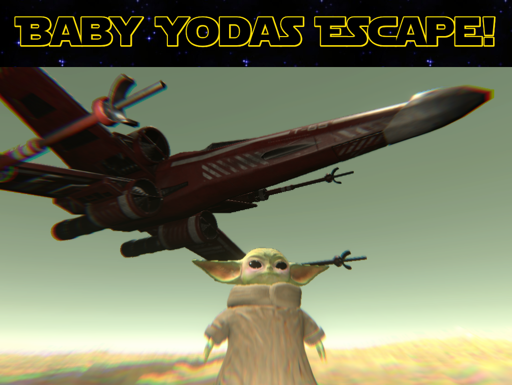

# Unity GameJam Project - Baby Yoda's Escape

An ultra quick 5 day put together project to have something for Sci Fi Miami's 4th (Star Wars Day) Gamejam.

This is a **Unity 2019.3** Universal Rendering Pipeline oriented project and makes use of the New Input System for handling
player input (keyboard and gamepad). 

The game makes heavy use of Scriptable Objects for both Events and Data. 
As such, you'll see a lot of GameEvent or GameEventListener type components on 
many game objects, which will broadcast (or listen for broadcasts) of events 
respectively and then handle it by invoking component methods on the respective game object.

The project makes use of a few [Unity FREE Particle Effects](https://assetstore.unity.com/packages/essentials/tutorial-projects/unity-particle-pack-127325), available on the Asset Store.

[Play the WebGL version on Itch.io](https://rodellison.itch.io/baby-yodas-escape)

# Creative Commons Attributions: 
Special credit to these awesome asset creators for the assets used!

- Oscar Selstam -  Free Red XWing on Sketchfab
- Metalmorag - Free Tie Fighter on Sketchfab
- Oscar Creativo  - Free Baby Yoda on Sketchfab
- Kenneys Assets - Itch.io

All Audio used was FREE on Freesound.Org - Credit to creators Hybrid_V, CraftyIndividual, Iwiploppenisse and Jammerboy70

Baby Yodas Escape is not affiliated with Lucasfilm Limited or The Walt Disney Company.  Star Wars and Star Wars character names are trademarks of Lucasfilm Limited / The Walt Disney Company. Baby Yodas Escape neither owns nor claims to own any portion of the Star Wars franchise. Baby Yodas Escape is an unaffiliated, fan-created game based off of products owned by the companies listed above. All custom artwork and coding for Baby Yodas Escape is credited to their creators, but intellectual property is owned by the above as well.